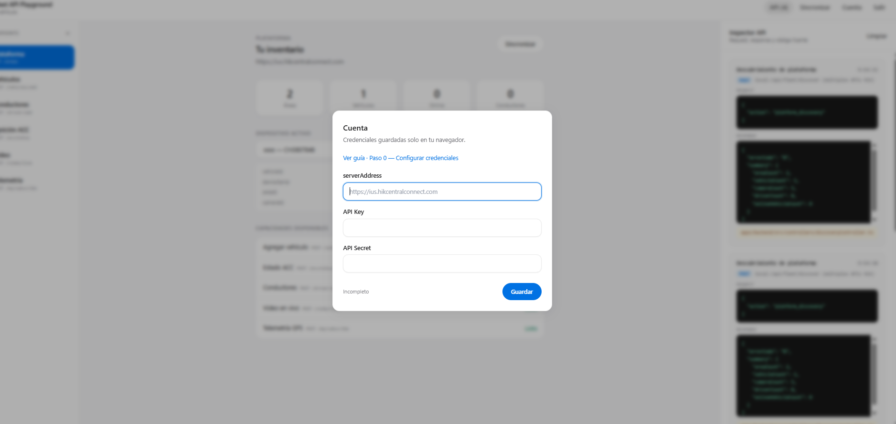
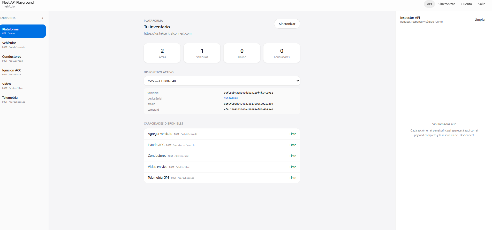
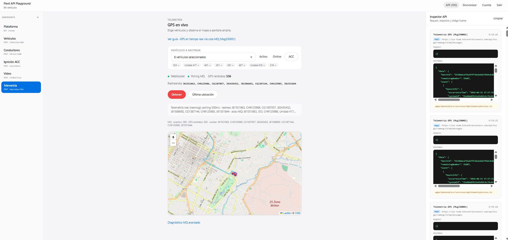
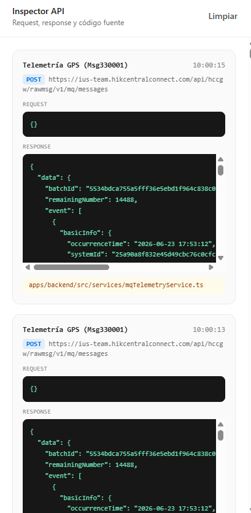
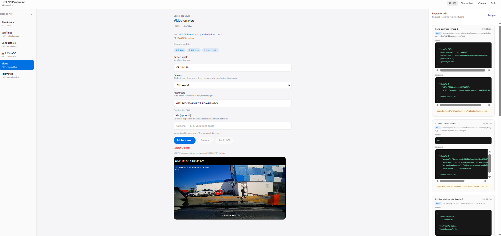
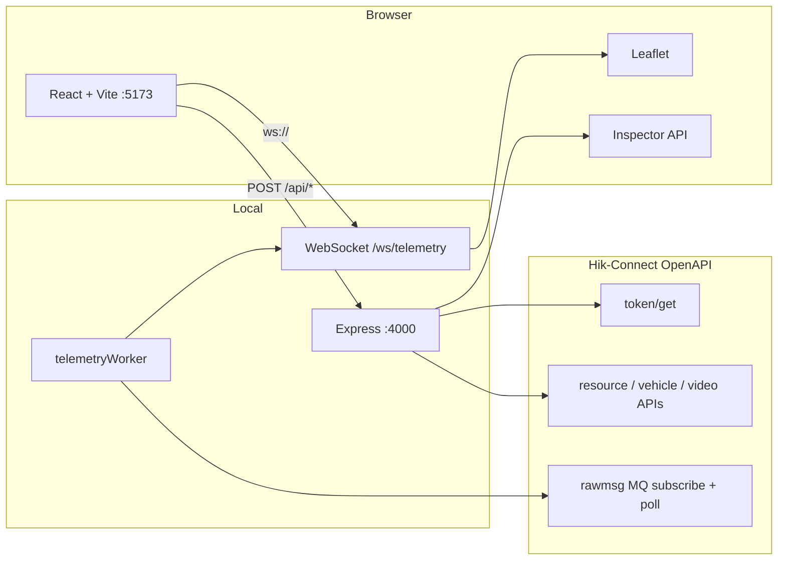

# Hik-Connect Fleet API Playground (Hikauto)

Playground interactivo **open-source** para probar la **OpenAPI V2.15.0** de **Monitoreo a bordo** (Hik-Connect for Teams): flota, conductores, ignición ACC, video en vivo, telemetría GPS vía MQ y mapa Leaflet.

> Parte del repositorio [SYSCOM-Labs/API-DOCS](https://github.com/SYSCOM-Labs/API-DOCS) en `HIKVISION/HikConnect-Team/demos/Hikauto/`.  
> Documentación API: [README de HikConnect-Team](../../README.md) · PDF oficial: [../../docs/](../../docs/)

---

## Instalación rápida

```bash
cd HIKVISION/HikConnect-Team/demos/Hikauto
npm install
npm run dev
```

Abre **http://localhost:5173** (frontend) · backend en **http://localhost:4000**.

---

## Tabla de contenidos

- [Vista previa](#vista-previa)
- [Arquitectura](#arquitectura)
- [Requisitos e instalación](#requisitos-e-instalación)
- [Primer uso](#primer-uso)
- [Interfaz del playground](#interfaz-del-playground)
- [Autenticación y credenciales](#autenticación-y-credenciales)
- [Endpoints del proxy local](#endpoints-del-proxy-local)
  - [Salud del servicio](#get-health)
  - [Descubrimiento de plataforma](#post-apifleetdiscover)
  - [Vehículos](#post-apifleetvehiclesadd)
  - [Estado ACC (ignición)](#post-apifleetvehiclesacc-status)
  - [Última ubicación GPS](#post-apifleetvehicleslast-locations)
  - [Conductores](#post-apifleetdriversadd)
  - [Despacho facial](#post-apifleetdriversface-dispatch)
  - [Estado despacho facial](#post-apifleetdriversface-status)
  - [Token de streaming](#get-apifleetstreamtoken)
  - [URL de video en vivo](#post-apifleetliveaddress)
  - [Telemetría — iniciar / detener / sonda](#telemetría)
  - [WebSocket GPS en tiempo real](#websocket-wstelemetry)
- [Cómo funciona el GPS en MQ](#cómo-funciona-el-gps-en-mq)
- [Estructura del proyecto](#estructura-del-proyecto)
- [Variables de entorno](#variables-de-entorno)
- [Modo sandbox](#modo-sandbox)
- [Solución de problemas](#solución-de-problemas)
- [Referencias](#referencias)

---

## Vista previa

<!-- Sustituye las rutas cuando subas capturas a docs/images/ -->

| Conexión | Plataforma | Telemetría GPS |
|----------|------------|----------------|
|  |  |  |

| Inspector API | Video en vivo |
|---------------|---------------|
|  |  |

---

## Arquitectura

El navegador **no llama directamente** a Hik-Connect (CORS y secreto). Un proxy Express local firma las peticiones, cachea el token y expone WebSocket para telemetría.



| Capa | Puerto | Rol |
|------|--------|-----|
| Frontend | `5173` | UI, formularios, mapa, EZUIKit |
| Backend | `4000` | Proxy Hik, worker MQ, WebSocket |
| Hik-Connect | HTTPS | APIs oficiales de tu tenant |

---

## Requisitos e instalación

- **Node.js** 18+ (recomendado 20 LTS)
- **npm** 9+
- Cuenta de desarrollador Hik-Connect con **appKey** y **secretKey**
- Dashcams móviles onboard en tu tenant (para pruebas reales)

```bash
git clone https://github.com/SYSCOM-Labs/API-DOCS.git
cd API-DOCS/HIKVISION/HikConnect-Team/demos/Hikauto
npm install
npm run dev
```

| Comando | Descripción |
|---------|-------------|
| `npm run dev` | Backend `:4000` + frontend `:5173` en paralelo |
| `npm run build` | Compila TypeScript (backend + frontend) |
| `npm run start` | Solo backend compilado (producción) |

Abre **http://localhost:5173**.

---

## Primer uso

1. En la pantalla de conexión, ingresa:
   - **serverAddress** — URL de tu tenant (ej. `https://ius.hikcentralconnect.com`)
   - **appKey** / **secretKey** — credenciales OpenAPI
2. Pulsa **Conectar** → el backend ejecuta descubrimiento (`/api/fleet/discover`).
3. Navega por el menú lateral: Plataforma, Vehículos, Conductores, ACC, Video, Telemetría.
4. Abre **Inspector API** (barra superior) para ver cada request/response crudo.

---

## Interfaz del playground

| Sección | Endpoint Hik relacionado | Para qué sirve |
|---------|--------------------------|----------------|
| **Plataforma** | Varios GET/batchquery | Inventario: áreas, vehículos, cámaras, conductores |
| **Vehículos** | `POST …/vehicles/add` | Alta de activo 1:1 con dashcam |
| **Conductores** | `POST …/driver/add` | Registro con foto biométrica |
| **Ignición ACC** | `POST …/accstatus/search` | Motor encendido/apagado por serial |
| **Video** | streamtoken + live/address | Vista en vivo EZOPEN (ezuikit-js) |
| **Telemetría** | MQ subscribe + messages | GPS en mapa vía Msg330001 |

El menú lateral es **compactable** (« / ») para ganar espacio en telemetría.

---

## Autenticación y credenciales

Todas las rutas POST del proxy esperan un body JSON con el sobre `_credentials`:

```json
{
  "_credentials": {
    "serverAddress": "https://ius.hikcentralconnect.com",
    "appKey": "TU_APP_KEY",
    "secretKey": "TU_SECRET_KEY"
  },
  "...campos de la operación..."
}
```

El backend:

1. Obtiene `accessToken` + `areaDomain` vía `POST /api/hccgw/platform/v1/token/get`.
2. Reenvía la operación a `{areaDomain}{ruta Hik}` con header `Token: {accessToken}`.
3. Devuelve `{ debug, data, error? }` para el Inspector API.

Las credenciales se guardan en **localStorage** del navegador; **nunca** se commitean al repositorio.

---

## Endpoints del proxy local

Convención de respuesta:

```typescript
{
  debug?: { verb, targetUrl, requestPayload, responseBody, sourceFile },
  data?: T,
  error?: string
}
```

---

### `GET /health`

Comprueba que el backend está activo (usado por el frontend antes de conectar).

**Respuesta:**

```json
{ "ok": true, "service": "hikconnect-fleet-playground", "version": "2.15.0" }
```

---

### `POST /api/fleet/discover`

**Para qué sirve:** Carga en una sola llamada el snapshot de tu tenant (áreas, vehículos con `deviceSerial`, cámaras, conductores, grupos).

**APIs Hik invocadas en paralelo:**

| Recurso | Ruta Hik |
|---------|----------|
| Áreas | `POST /api/hccgw/resource/v1/areas/search` |
| Vehículos | `POST /api/hccgw/resource/v1/vehicles/search` |
| Cámaras | `POST /api/hccgw/resource/v1/cameras/search` + dispositivos |
| Conductores | `POST /api/hccgw/vehicle/v1/driver/batchquery` |
| Grupos | `POST /api/hccgw/vehicle/v1/driverGroup/batchquery` |

**Body mínimo:**

```json
{ "_credentials": { "serverAddress": "...", "appKey": "...", "secretKey": "..." } }
```

**Uso en UI:** Pantalla de conexión y botón **Sincronizar**.

---

### `POST /api/fleet/vehicles/add`

**Para qué sirve:** Registrar un vehículo vinculado **1:1** a un dashcam (`deviceSerial` único — PDF §1.2.9).

**Proxy → Hik:** `POST /api/hccgw/resource/v1/areas/vehicles/add`

**Campos requeridos:**

| Campo | Tipo | Descripción |
|-------|------|-------------|
| `areaId` | string | ID de área (del descubrimiento) |
| `licensePlateNo` | string | Placa o alias |
| `vehicleType` | 0–3 | 0=otros, 1=auto, 2=camión, 3=bus |
| `deviceSerial` | string | Serial del dashcam ya dado de alta en Hik-Connect |

**Ejemplo:**

```json
{
  "_credentials": { "...": "..." },
  "areaId": "381019761120777216",
  "licensePlateNo": "ABC-1234",
  "vehicleType": 1,
  "deviceSerial": "CH3807848"
}
```

**Uso en UI:** Pestaña **Vehículos**.

---

### `POST /api/fleet/vehicles/acc-status`

**Para qué sirve:** Consultar ignición ACC por serial(es) o vehicleId(s).

**Proxy → Hik:** `POST /api/hccgw/resource/v1/accstatus/search`

**Campos:** `deviceSerials` (CSV o array) **o** `vehicleIds`.

**Interpretación `accStatus`:**

| Valor | Significado |
|-------|-------------|
| `1` | ACC encendido / motor on |
| `0` | ACC apagado |
| `-1` | Sin reporte |

**Uso en UI:** Pestaña **Ignición ACC** y botón **ACC** en telemetría.

---

### `POST /api/fleet/vehicles/last-locations`

**Para qué sirve:** Obtener última posición conocida. OpenAPI **no** expone un GET de “última posición”; esta ruta combina cache en memoria + escucha MQ opcional.

**Body:**

| Campo | Tipo | Descripción |
|-------|------|-------------|
| `deviceSerials` | string[] | Seriales a consultar |
| `vehicleRegistry` | object[] | `{ deviceSerial, name, licensePlateNo }` para emparejar nombres MQ |
| `refresh` | boolean | Si `true`, escucha la cola MQ |
| `waitSeconds` | number | Segundos de escucha (default 30) |

**Respuesta `data`:**

```json
{
  "locations": [{ "deviceSerial", "lat", "lng", "speedKmh", "occurrenceTime", ... }],
  "source": "cache" | "mq" | "mixed",
  "verdict": "texto explicativo",
  "mqEventCount": 0
}
```

**Uso en UI:** Botón **Última ubicación** en telemetría.

---

### `POST /api/fleet/drivers/add`

**Para qué sirve:** Alta de conductor con metadatos y **photoData** (JPG Base64, rostro visible, máx. 5 MB).

**Proxy → Hik:** `POST /api/hccgw/vehicle/v1/driver/add`

**Campos clave:**

| Campo | Notas |
|-------|-------|
| `driverCode` | Código único del conductor |
| `groupId` | ID real del grupo (no usar `"1"`) |
| `gender` | 0=desconocido, 1=masc, 2=fem |
| `photoData` | Base64 obligatorio para biometría |
| `relateVehicleIds` | Opcional — vincular a vehículos |

Errores frecuentes decodificados en backend: `CCF038052` (email duplicado), `CCF038009` (groupId/foto inválida).

**Uso en UI:** Pestaña **Conductores**.

---

### `POST /api/fleet/drivers/face-dispatch`

**Para qué sirve:** Despachar credenciales faciales al almacenamiento del dashcam (proceso asíncrono).

**Proxy → Hik:** `POST /api/hccgw/vehicle/v1/driverFace/distribution`

```json
{ "_credentials": { "...": "..." }, "driverIds": ["id-conductor-1"] }
```

---

### `POST /api/fleet/drivers/face-status`

**Para qué sirve:** Consultar progreso del despacho facial con el `guid` devuelto por distribution.

**Proxy → Hik:** `POST /api/hccgw/vehicle/v1/driverFace/status/query`

---

### `GET /api/fleet/stream/token`

**Para qué sirve:** Obtener `appToken` para el JSSDK EZUIKit (~7 días de validez).

**Proxy → Hik:** `GET /api/hccgw/platform/v1/streamtoken/get`

**Credenciales:** query `?_credentials=encodeURIComponent(JSON.stringify({...}))`

**Uso en UI:** Pestaña **Video** (antes de reproducir).

---

### `POST /api/fleet/live/address`

**Para qué sirve:** URL EZOPEN/RTMP para live view del dashcam.

**Proxy → Hik:** `POST /api/hccgw/video/v1/live/address/get`

| Campo | Descripción |
|-------|-------------|
| `deviceSerial` | Serial del dashcam |
| `resourceId` | ID del canal/cámara |
| `type` | `"1"` = live view |
| `protocol` | `1` = EZOPEN |
| `cameraChannel` | Número de canal en URL (ej. `5` para canal 5) |
| `code` | Código de verificación del dispositivo (si aplica) |

> **Audio bidireccional:** solo canal **1** (PDF §1.2.9).

**Uso en UI:** Pestaña **Video en vivo**.

---

## Telemetría

### `POST /api/telemetry/start`

Inicia el worker de polling MQ (500 ms) y suscripción a eventos onboard.

**Body:**

```json
{
  "_credentials": { "...": "..." },
  "sandboxMode": false,
  "subscribeMode": "onboard-full",
  "mqQueue": "rawmsg",
  "deviceSerials": ["CH3807848"],
  "vehicleRegistry": [
    { "deviceSerial": "CH3807848", "name": "Unidad 351", "licensePlateNo": "ABC-1234" }
  ]
}
```

| Campo | Descripción |
|-------|-------------|
| `deviceSerials` | Seriales del inventario a rastrear (vacío = toda la flota MQ) |
| `vehicleRegistry` | Mapeo nombre MQ ↔ serial (Hik usa `device.name` = "Unidad 351") |
| `sandboxMode` | `true` simula GPS en Chihuahua sin red Hik |

**Flujo interno:**

1. `POST …/rawmsg/v1/mq/subscribe` (Msg330001, alarmas DSM, etc.)
2. Loop: `POST …/rawmsg/v1/mq/messages` → parse GPS → WebSocket
3. `POST …/rawmsg/v1/mq/messages/complete` (confirma `batchId`)

### `POST /api/telemetry/stop`

Detiene el worker y libera el intervalo de polling.

### `POST /api/telemetry/probe`

Sonda MQ sin worker permanente: un poll instantáneo o escucha N segundos.

```json
{
  "_credentials": { "...": "..." },
  "subscribeMode": "onboard-full",
  "mqQueue": "rawmsg",
  "waitSeconds": 60
}
```

### `POST /api/telemetry/status`

Estado del worker: `{ running, sandboxMode }`.

---

### WebSocket `ws://localhost:4000/ws/telemetry`

Canal push hacia el mapa. Mensajes JSON:

| type | Contenido |
|------|-----------|
| `gps` | `{ lat, lng, speedKmh, deviceSerial, licensePlate, … }` |
| `alarm` | Alarma DSM (fumar, fatiga, etc.) |
| `status` | Texto operativo (polling activo, cola vacía en este poll, etc.) |
| `diag` | Métricas MQ: eventCount, gpsParsed, totalGpsEmitted |
| `debug` | Resultado de subscribe u otros |

En producción detrás de Vite dev, el frontend usa `ws://{hostname}:4000/ws/telemetry`.

---

## Cómo funciona el GPS en MQ

Los eventos **no traen lat/lng en la cabecera**. Estructura simplificada:

```json
{
  "basicInfo": {
    "msgType": "Msg330001",
    "occurrenceTime": "2025-06-16 16:18:48",
    "device": { "name": "Unidad 351" }
  },
  "data": {
    "vehicleRelatedInfo": {
      "gpsInfo": {
        "lat": "28.628561",
        "lng": "106.070414",
        "ns": "N",
        "ew": "W",
        "speed": 450000,
        "direction": 180
      },
      "vehicleInfo": { "licensePlate": "ABC-1234" }
    }
  }
}
```

**Transformaciones** (`apps/backend/src/utils/gpsParser.ts`):

| Campo Hik | Salida demo |
|-----------|-------------|
| `lat` + `ns` | Latitud con signo (S = negativo) |
| `lng` + `ew` | Longitud con signo (W = negativo) |
| `speed` | cm/h → **km/h** (÷ 100 000) |
| `direction` | Grados 0–360 (normaliza valores > 360) |
| `device.name` | Emparejado con inventario → `deviceSerial` en mapa |

**Cola MQ:** cada poll puede traer **0 o N** eventos. Tras leer un lote, la cola queda vacía hasta el próximo reporte del vehículo en nube — es comportamiento normal, no un error.

---

## Estructura del proyecto

```
API-DOCS/HIKVISION/HikConnect-Team/demos/Hikauto/
├── apps/
│   ├── backend/                 # Proxy Express + worker MQ + WebSocket
│   └── frontend/                # React + Vite + Tailwind + Leaflet
├── docs/images/                 # Capturas para este README
├── reference/                   # Enlaces a documentación oficial
├── package.json
└── README.md
```

---

## Variables de entorno

| Variable | Default | Descripción |
|----------|---------|-------------|
| `PORT` | `4000` | Puerto del backend |
| `MQ_DEBUG` | activo | Logs `[hik-mq]` en consola; usar `MQ_DEBUG=0` para silenciar |

---

## Modo sandbox

Desde la pantalla de conexión, **Modo exploración** activa telemetría simulada:

- GPS sintético en ruta de Chihuahua
- Alarmas DSM aleatorias
- Sin llamadas a servidores Hikvision

Útil para demos offline o desarrollo de UI.

---

## Solución de problemas

| Síntoma | Causa probable | Qué hacer |
|---------|----------------|-----------|
| `No se pudo contactar al backend` | Backend no corre | `npm run dev` en la raíz |
| Subscribe `OPEN000010` | msgType inválido | Revisar Inspector API; el backend reintenta modos fallback |
| Logs con eventos pero mapa vacío | Filtro vehículo vs nombre MQ | Verificar selección; revisar `vehicleRegistry` |
| UI dice “cola vacía” pero hay `[hik-mq] poll` con eventos | Poll **actual** vacío tras ráfaga | Normal — esperar siguiente Msg330001 |
| Conductor `CCF038052` | Email duplicado | Usar otro email |
| Conductor `CCF038009` | groupId o foto inválida | groupId real + JPG con rostro |
| Video sin imagen | Canal o code incorrecto | Probar canal 1 o 5; revisar `live/address` en HUD |

Activa logs detallados en la terminal del backend: `[hik-mq] poll { eventCount, gpsParsed, serials }`.

---

## Referencias

| Documento | Ubicación |
|-----------|-----------|
| Developer Guide V2.15.0 | [../../docs/Hik-Connect for Teams OpenAPI Developer Guide_V2.15.0_20260306.pdf](../../docs/) |
| Documentación API (ES) | [../../README.md](../../README.md) |
| Apéndice A (códigos de error) | [../../APENDICE-A.md](../../APENDICE-A.md) |
| Demo video (EZUIKit) | [../video/README.md](../video/README.md) |
| Capturas GitHub | [docs/images/](docs/images/) |

---

## Licencia y aviso

Proyecto educativo / demostración. **Hikvision**, **Hik-Connect** y marcas relacionadas son propiedad de sus titulares. Usa credenciales y datos de flota bajo las políticas de tu organización; no publiques appKey, secretKey ni fotos biométricas reales.
