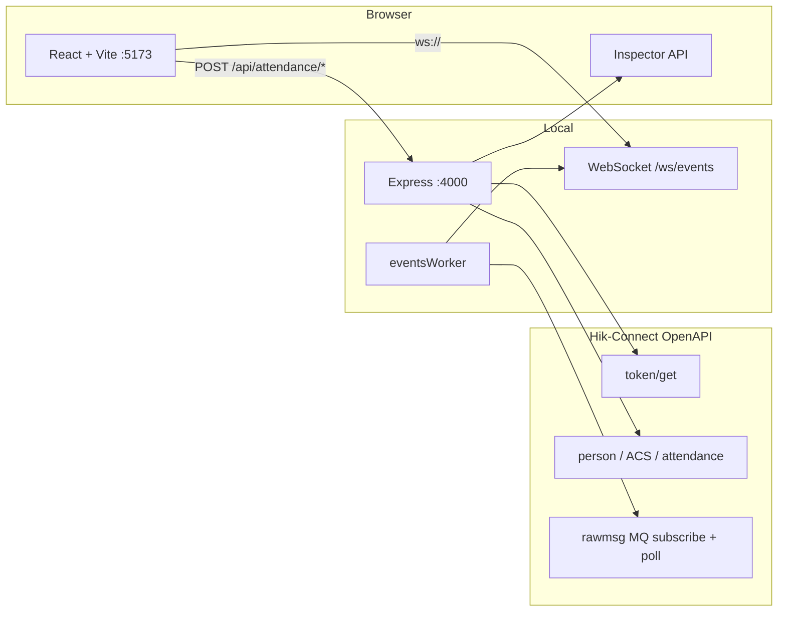

# Tiempo y asistencia con Hik-Connect Teams OpenAPI

Playground interactivo **open-source** para demostrar la **OpenAPI V2.15.0** de **Tiempo y Asistencia / Control de acceso** en **Hik-Connect for Teams**: departamentos, personas, credenciales (PIN, QR, tarjeta, huella), niveles de acceso, apertura remota de puertas, marcajes (certificate records), reporte time card, KPIs del día y eventos en vivo vía MQ.

> Parte del repositorio [SYSCOM-Labs/API-DOCS](https://github.com/SYSCOM-Labs/API-DOCS) en  
> `HIKVISION/HikConnect-Team/demos/Tiempo y asistencia con Hikconnect teams openapi/`.  
> Documentación API: [README de HikConnect-Team](../../README.md) · PDF oficial: [../../docs/](../../docs/)

**Autor:** [ArmandoBaca](https://github.com/ArmandoBaca) · SYSCOM

---

## Tabla de contenidos

- [Instalación rápida](#instalación-rápida)
- [Arquitectura](#arquitectura)
- [Requisitos e instalación](#requisitos-e-instalación)
- [Primer uso](#primer-uso)
- [Interfaz del playground](#interfaz-del-playground)
- [Autenticación y credenciales](#autenticación-y-credenciales)
- [Endpoints del proxy local](#endpoints-del-proxy-local)
- [Cómo funcionan los eventos en vivo](#cómo-funcionan-los-eventos-en-vivo)
- [Marcajes vs time card](#marcajes-vs-time-card)
- [Estructura del proyecto](#estructura-del-proyecto)
- [Variables de entorno](#variables-de-entorno)
- [Modo sandbox](#modo-sandbox)
- [Flujo de demo sugerido](#flujo-de-demo-sugerido)
- [Límites de la OpenAPI](#límites-de-la-openapi)
- [Solución de problemas](#solución-de-problemas)
- [Referencias](#referencias)
- [Licencia y aviso](#licencia-y-aviso)

---

## Instalación rápida

```bash
cd "HIKVISION/HikConnect-Team/demos/Tiempo y asistencia con Hikconnect teams openapi"
npm install
npm run dev
```

- Frontend: **http://localhost:5173**
- Backend proxy: **http://localhost:4000**
- WebSocket eventos: `ws://localhost:4000/ws/events`

---

## Arquitectura

El navegador **no llama directamente** a Hik-Connect (CORS y secreto). Un proxy Express local obtiene el token, reenvía las APIs y expone WebSocket para el feed de eventos.



| Capa | Puerto | Rol |
|------|--------|-----|
| Frontend | `5173` | UI, formularios, Inspector API |
| Backend | `4000` | Proxy Hik, worker MQ, WebSocket |
| Hik-Connect | HTTPS | OpenAPI del tenant |

### Electron / apps de escritorio

El mismo patrón (UI + proxy local que mantiene el secreto fuera del bundle público) sirve como base para empaquetar con **Electron**: el proceso main puede hostear el proxy Express y el renderer la UI React.

---

## Requisitos e instalación

- **Node.js** 18+ (recomendado 20 LTS)
- **npm** 9+
- Tenant Hik-Connect for Teams con **AppKey** y **SecretKey** (administrador del tenant)
- Dispositivos ACS online y puertas asociadas (para pruebas reales)
- Turnos de asistencia configurados en el **portal** si se quieren KPIs / retardo / falta

```bash
git clone https://github.com/SYSCOM-Labs/API-DOCS.git
cd "API-DOCS/HIKVISION/HikConnect-Team/demos/Tiempo y asistencia con Hikconnect teams openapi"
npm install
npm run dev
```

| Comando | Descripción |
|---------|-------------|
| `npm run dev` | Backend `:4000` + frontend `:5173` en paralelo |
| `npm run build` | Compila TypeScript (backend + frontend) |
| `npm run start` | Solo backend compilado |

Abre **http://localhost:5173**.

---

## Primer uso

1. En la pantalla de conexión ingresa:
   - **API Key** (`appKey`) y **API Secret** (`secretKey`)
   - Opcionalmente la región (`serverAddress`): NA `ius`, SA `isa`, EU `ieu`, SG `isgp`
2. Pulsa **Conectar** → el backend ejecuta descubrimiento (`POST /api/attendance/discover`).
3. Navega por el menú: Dashboard, Plataforma, Personas, Niveles, Puertas, Marcajes, Time card, Eventos.
4. Abre **Inspector API** para ver cada request/response crudo hacia Hik-Connect.

También puedes entrar en **modo Sandbox** (datos ficticios) sin tenant real.

---

## Interfaz del playground

| Sección | Endpoint Hik relacionado | Para qué sirve |
|---------|--------------------------|----------------|
| **Dashboard** | `attendance/…/totaltimecard/list` | KPIs del día (normal, retardo, salida temprana, falta, etc.) |
| **Plataforma** | areas / devices / doors / groups | Inventario ACS descubierto del tenant |
| **Personas** | `person/v1/groups/*`, `persons/*` | Departamentos, altas, foto, PIN, QR, tarjeta, huella |
| **Niveles** | `acspm/v1/accesslevel/*` | Listar, crear y asignar niveles de acceso |
| **Puertas** | `acs/v1/remote/control` | Apertura remota |
| **Marcajes** | `acs/…/certificaterecords/search` | Historial de autenticaciones ACS |
| **Time card** | `attendance/…/totaltimecard/list` | Reporte calculado; fallback desde marcajes |
| **Eventos** | `rawmsg/v1/mq/*` + fallback records | Feed en vivo por WebSocket |

---

## Autenticación y credenciales

Todas las rutas POST del proxy esperan un body JSON con el sobre `_credentials`:

```json
{
  "_credentials": {
    "serverAddress": "https://ius.hikcentralconnect.com",
    "appKey": "TU_APP_KEY",
    "secretKey": "TU_SECRET_KEY"
  },
  "...campos de la operación..."
}
```

El backend:

1. Obtiene `accessToken` + `areaDomain` vía `POST /api/hccgw/platform/v1/token/get`.
2. Reenvía la operación a `{areaDomain}{ruta Hik}` con header `Token: {accessToken}`.
3. Devuelve `{ debug, data, error? }` para el Inspector API.

Las credenciales se guardan en **localStorage** del navegador; **nunca** se commitean al repositorio.

En Hik-Connect for Teams el AppKey del tenant es de **administrador**: no hay un modelo de permisos granulares por departamento como en otros productos. El alcance de datos lo define el tenant y la configuración del portal.

---

## Endpoints del proxy local

Convención de respuesta:

```typescript
{
  debug?: { verb, targetUrl, requestPayload, responseBody, sourceFile },
  data?: T,
  error?: string
}
```

Prefijo: `/api/attendance`

---

### `GET /health`

Comprueba que el backend está activo.

```json
{ "ok": true, "service": "hikconnect-attendance-playground", "version": "2.15.0" }
```

---

### `POST /api/attendance/discover`

**Para qué sirve:** Snapshot del tenant para asistencia: áreas, dispositivos ACS, puertas y departamentos (person groups).

**APIs Hik típicas:**

| Recurso | Ruta Hik |
|---------|----------|
| Áreas | `POST /api/hccgw/resource/v1/areas/get` (o búsqueda según tenant) |
| Dispositivos | `POST /api/hccgw/resource/v1/devices/get` |
| Puertas | `POST /api/hccgw/resource/v1/areas/doors/get` |
| Departamentos | `POST /api/hccgw/person/v1/groups/search` |

**Uso en UI:** pantalla de conexión y pestaña **Plataforma**.

---

### Personas y departamentos

| Proxy local | Hik OpenAPI |
|-------------|-------------|
| `POST /api/attendance/groups/search` | `person/v1/groups/search` |
| `POST /api/attendance/groups/add` | `person/v1/groups/add` |
| `POST /api/attendance/groups/delete` | `person/v1/groups/delete` |
| `POST /api/attendance/persons/list` | `person/v1/persons/search` (o listado equivalente) |
| `POST /api/attendance/persons/add` | `person/v1/persons/add` |
| `POST /api/attendance/persons/quick-add` | alta rápida con credenciales opcionales |
| `POST /api/attendance/persons/delete` | `person/v1/persons/delete` |
| `POST /api/attendance/persons/photo` | foto facial |
| `POST /api/attendance/persons/pin` | actualización de PIN |
| `POST /api/attendance/persons/qrcode` | generación / consulta QR |
| `POST /api/attendance/persons/card-collect` | captura de tarjeta en dispositivo |
| `POST /api/attendance/persons/finger-collect` | captura de huella en dispositivo |
| `POST /api/attendance/persons/update-cards` | asociar tarjetas |
| `POST /api/attendance/persons/update-fingers` | asociar huellas |

**Uso en UI:** pestaña **Personas**.

---

### Niveles de acceso

| Proxy local | Hik OpenAPI |
|-------------|-------------|
| `POST /api/attendance/access-levels/list` | `acspm/v1/accesslevel/…` (listado) |
| `POST /api/attendance/access-levels/add` | creación de nivel |
| `POST /api/attendance/access-levels/templates` | listado de plantillas horarias |
| `POST /api/attendance/access-levels/assign` | asignación a personas |
| `POST /api/attendance/access-levels/remove` | desasignación |

> Las **plantillas horarias de acceso** se administran en el portal; la OpenAPI las lista / usa, pero no sustituye el diseño del horario en Hik-Connect.

**Uso en UI:** pestaña **Niveles**.

---

### Puertas remotas

### `POST /api/attendance/doors/remote-control`

**Proxy → Hik:** `POST /api/hccgw/acs/v1/remote/control`

**Nota de integración:** `elementlist` debe ser un arreglo de **IDs de puerta (string[])**, no objetos. Revisar `operationResult` en la respuesta.

**Uso en UI:** pestaña **Puertas**.

---

### Marcajes (certificate records)

### `POST /api/attendance/records/search`

**Proxy → Hik:** `POST /api/hccgw/acs/v1/event/certificaterecords/search`

Campos útiles de cada registro (nombres reales de la API):

| Campo | Significado |
|-------|-------------|
| `swipeAuthResult` | Resultado de autenticación |
| `personInfo` | Datos de la persona |
| `eventType` | Tipo de evento |
| `elementName` | Puerta / elemento |
| `eventTime` | Marca de tiempo |

**Importante:** las fechas deben enviarse en ISO **con offset local** (no solo `Z` de `toISOString()`), para alinear el día del tenant con el reporte.

**Uso en UI:** pestaña **Marcajes** y fallback de Time card / Eventos.

---

### Time card / reporte de asistencia

### `POST /api/attendance/report/timecard`

**Proxy → Hik:** `POST /api/hccgw/attendance/v1/report/totaltimecard/list`

Entrega el **resultado calculado** del día (estado, retardo, horas) cuando hay marcajes contra un turno asignado en **Attendance → Schedule** del portal.

Si el reporte viene vacío (`errorCode=0` y `reportDataList=[]`) pero existen marcajes, la UI puede **reconstruir** la tarjeta diaria a partir de `certificaterecords/search` (equivalente a una exportación Time Card que solo muestra la columna Records).

**Uso en UI:** pestañas **Time card** y **Dashboard**.

---

### Eventos en vivo

| Proxy local | Rol |
|-------------|-----|
| `POST /api/attendance/events/start` | Suscribe MQ + inicia worker |
| `POST /api/attendance/events/stop` | Detiene worker |
| `POST /api/attendance/events/status` | Estado del feed |
| `WS /ws/events` | Push al navegador |

**Uso en UI:** pestaña **Eventos**.

---

### `POST /api/attendance/proxy`

Reenvío genérico a una ruta Hik (útil para pruebas desde el Inspector / desarrollo).

---

## Cómo funcionan los eventos en vivo

1. `POST …/rawmsg/v1/mq/subscribe` (canales típicos: `rawmsg`, `alarm`, `combine` según disponibilidad del tenant).
2. Polling de `POST …/rawmsg/v1/mq/messages`.
3. Confirmación con `POST …/rawmsg/v1/mq/messages/complete` (`batchId`).
4. El worker publica al WebSocket `/ws/events`.

Muchos tenants **no empujan** eventos ACS en la cola MQ de forma fiable. Por eso el demo también puede complementar el feed con sondeos periódicos a `certificaterecords/search`.

> Webhook push requiere URL pública; este playground usa **polling MQ local** a propósito.

---

## Marcajes vs time card

| Concepto | Fuente | Qué representa |
|----------|--------|----------------|
| Marcaje | `certificaterecords/search` | Autenticación real en puerta/dispositivo |
| Time card | `totaltimecard/list` | Día laborable **calculado** (turno, estado, duraciones) |
| Schedule | Portal Hik-Connect | Asigna el horario; la OpenAPI **no** define la política |

Sin turno asignado (o sin cálculo aún disponible), el reporte puede devolver 0 filas aunque haya marcajes. En ese caso el playground muestra la reconstrucción desde records.

---

## Estructura del proyecto

```
Tiempo y asistencia con Hikconnect teams openapi/
├── package.json              # workspaces + npm run dev
├── package-lock.json
├── .env.example
├── .gitignore
├── README.md
└── apps/
    ├── backend/              # Express proxy + eventsWorker
    │   ├── package.json
    │   ├── tsconfig.json
    │   └── src/
    │       ├── app.ts
    │       ├── index.ts
    │       ├── controllers/
    │       ├── middleware/
    │       ├── services/     # hikAuth, hikClient, MQ, sandbox, discovery
    │       ├── workers/
    │       ├── websocket/
    │       └── types/
    └── frontend/             # React + Vite + Tailwind
        ├── package.json
        ├── vite.config.ts
        ├── index.html
        └── src/
            ├── App.tsx
            ├── api/
            ├── components/   # tabs, Connect, Inspector API
            ├── hooks/
            ├── lib/          # normalización de respuestas Hik
            └── types.ts
```

---

## Variables de entorno

Las credenciales se configuran en la **UI** (no en `.env` del repo).

`.env.example` solo documenta la región de ejemplo:

```bash
# HCT_SERVER_ADDRESS=https://ius.hikcentralconnect.com
```

Opcional en el backend (si se añaden flags de depuración en despliegues locales): logs de MQ / latencia en consola.

---

## Modo sandbox

Desde la pantalla de conexión, **Entrar en modo Sandbox** activa datos ficticios:

- Departamentos y personas de ejemplo
- Niveles de acceso, marcajes y time card simulados
- Eventos sintéticos en el feed
- Sin llamadas a servidores Hikvision

Útil para demos offline o desarrollo de UI. **No sustituye** la validación con dispositivo ACS real.

---

## Flujo de demo sugerido

1. Conectar con credenciales del tenant (o Sandbox).
2. Revisar **Plataforma** (ACS online y puertas).
3. Crear departamento → alta rápida de persona → asignar nivel de acceso.
4. Abrir puerta remota / generar marcaje en el dispositivo.
5. Consultar **Marcajes** y **Time card**; mostrar KPIs en **Dashboard**.
6. Activar **Eventos** + Inspector API para mostrar request/response.

---

## Límites de la OpenAPI

- Turnos, horarios y políticas de asistencia se configuran en el **portal**; la OpenAPI **consulta** resultados.
- Captura de huella/tarjeta requiere interacción en el dispositivo físico.
- Rate limit oficial: **máx. 5 requests/s**.
- Token válido **7 días**; el proxy lo renueva proactivamente.
- Webhook push requiere URL pública; este demo usa polling MQ.

---

## Solución de problemas

| Síntoma | Causa probable | Qué hacer |
|---------|----------------|-----------|
| `No se pudo contactar al backend` | Backend no corre | `npm run dev` en la raíz del demo |
| Departamentos vacíos en selector | `groupIdList` vacío inválido / parseo | Descubrir grupos; no enviar listas vacías |
| Personas sin nombre | Payload anidado (`personBaseInfo`) | El frontend normaliza; revisar Inspector API |
| Niveles de acceso vacíos | Lista bajo `accessLevelResponse` | Crear nivel o refrescar listado |
| Apertura remota sin efecto | `elementlist` mal tipado | Usar `string[]` de door IDs; ver `operationResult` |
| Marcajes / time card vacíos | Fechas en `Z` sin offset | Usar ISO con offset local del día |
| Time card vacío con marcajes | Sin turno o cálculo aún no listo | Revisar Schedule en portal; usar vista reconstruida |
| Eventos MQ vacíos con punches | Tenant no empuja ACS a rawmsg | Dejar activo el fallback de certificaterecords |

---

## Referencias

| Documento | Ubicación |
|-----------|-----------|
| Developer Guide V2.15.0 | [../../docs/](../../docs/) |
| Documentación API (ES) | [../../README.md](../../README.md) |
| Apéndice A (códigos de error) | [../../APENDICE-A.md](../../APENDICE-A.md) |
| Historial de actualizaciones | [../../HISTORIAL-ACTUALIZACIONES.md](../../HISTORIAL-ACTUALIZACIONES.md) |
| Demo video (EZUIKit) | [../video/README.md](../video/README.md) |
| Demo Hikauto (Fleet) | [../Hikauto/README.md](../Hikauto/README.md) |
| Skill para agentes (ClawHub) | [../../../HikConnect-Team-Skill/README.md](../../../HikConnect-Team-Skill/README.md) |

---

## Licencia y aviso

Proyecto educativo / demostración para clientes SYSCOM. **Hikvision**, **Hik-Connect** y marcas relacionadas son propiedad de sus titulares. Usa credenciales y datos de personas bajo las políticas de tu organización; **no publiques** appKey, secretKey ni biométricos reales.

---

**ArmandoBaca** · SYSCOM Labs
