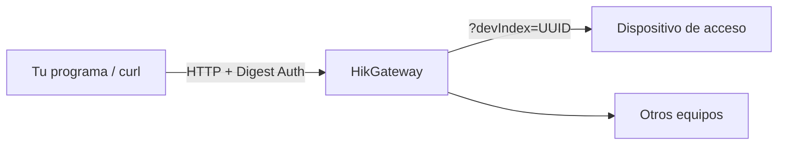
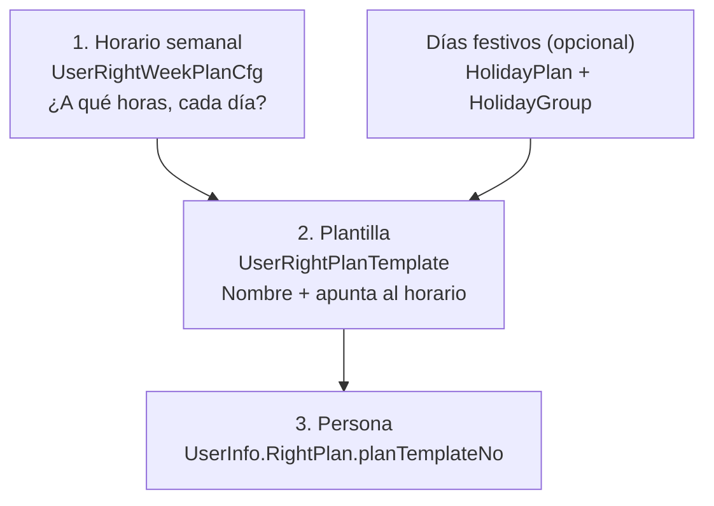

# Horarios de acceso vía HikGateway

Demo enfocado a desarrolladores: muestra **cómo se construyen y envían las
peticiones** para configurar horarios y plantillas en dispositivos de control
de acceso Hikvision a través del **HikGateway** (API ISAPI en JSON).

No es solo un ejecutor de comandos. En cada paso se ve **qué se envía, en qué
orden y por qué** (explicación, endpoint, cuerpo JSON y `curl` equivalente),
para poder integrar el mismo flujo en otra aplicación.

---

## Qué incluye este repositorio

Este proyecto es una demo de las peticiones de configuración de horarios
(semana → plantilla → asignación a persona) sobre dispositivos de acceso
expuestos por HikGateway.

| Archivo | Descripción |
|---------|-------------|
| [`asistente.py`](asistente.py) | Interfaz por menú: conexión, detección del dispositivo, capacidades, creación de horarios y exportación del código de las peticiones |
| [`asistente.bat`](asistente.bat) | Lanzador en Windows (instala `requests` si hace falta y abre el asistente) |
| [`demo_horarios_hikgateway.py`](demo_horarios_hikgateway.py) | Recorrido lineal paso a paso: en cada petición imprime explicación, JSON formateado y `curl` antes de ejecutar |
| [`requirements.txt`](requirements.txt) | Dependencia: `requests` |

Las credenciales se piden al iniciar y **no se guardan** en ningún archivo.

---

## Arranque rápido

Requisitos: Python 3.9+.

```powershell
pip install -r requirements.txt
```

**Asistente (menú interactivo):**

```powershell
python asistente.py
```

o `asistente.bat` en Windows. Pide dirección del gateway, usuario y
contraseña; lista los dispositivos de acceso y muestra las opciones.

**Demo lineal (tutorial de peticiones):**

```powershell
python demo_horarios_hikgateway.py
```

Opciones útiles del demo:

| Flag | Efecto |
|------|--------|
| `--solo-mostrar` | Imprime endpoint, JSON y `curl` **sin** llamar al gateway |
| `--escenario diurno\|nocturno\|ambos` | Fija el caso sin preguntar |
| `--sin-usuario` | Omite la asignación a una persona |
| `--host http://...` | Salta la pregunta de URL |

---


## 1. Cómo encaja todo: gateway, dispositivo y `devIndex`

El **HikGateway** es un puente. Tu programa no habla directo con el
biométrico o el panel: habla con el gateway, y este reenvía la orden al
equipo correcto.




Dos cosas van en casi todas las peticiones:

1. **Autenticación Digest** — usuario y contraseña del gateway.
  En `curl`: `--digest -u "usuario:password"`.
2. `devIndex` — UUID del equipo destino. El gateway puede administrar
  varios dispositivos, así que cada ISAPI lleva
   `?format=json&devIndex=<UUID>`.

El `devIndex` se obtiene listando los dispositivos (paso 1 del flujo).

Ejemplo mínimo de `curl` (cualquier GET):

```bash
curl -sS -X GET \
  "http://GATEWAY/ISAPI/AccessControl/capabilities?format=json&devIndex=UUID" \
  --digest -u "admin:TU_PASSWORD" \
  -H "Content-Type: application/json"
```

> En PowerShell usa `curl.exe` (el alias `curl` es otra cosa).

---


## 2. El modelo de datos: horario → plantilla → persona

Esta es la parte central de la documentación (sección *User Permission
Schedule* de la *API Developer Guide*). La idea clave:

**Una persona no se liga directamente a un horario.** Hay tres capas:




En palabras sencillas:


| Capa                    | Endpoint                             | Qué define                                                                               |
| ----------------------- | ------------------------------------ | ---------------------------------------------------------------------------------------- |
| **Horario semanal**     | `UserRightWeekPlanCfg/<id>`          | Franjas por día. Hasta **8 franjas** por día, Lunes a Domingo                            |
| **Festivos** (opcional) | `HolidayPlanCfg` + `HolidayGroupCfg` | Excepciones (feriados, puentes)                                                          |
| **Plantilla**           | `UserRightPlanTemplate/<id>`         | Nombre del conjunto + `weekPlanNo` (+ festivos). **Esto es lo que se asigna a personas** |
| **Persona**             | `UserInfo/Modify`                    | `RightPlan[].planTemplateNo` = qué plantilla la gobierna                                 |


Cada objeto se identifica con un **número (ID) en la URL**, que empieza en 1.
Ejemplo: el horario 2 se configura en `.../UserRightWeekPlanCfg/2`.

> En muchos biométricos faciales, la **plantilla 1** viene de fábrica como
> “acceso todo el día”. Por eso los ejemplos usan el **ID 2**.

El orden importa:

```
horario semanal  →  plantilla  →  (opcional) asignar a persona
```

Un horario solo tiene efecto cuando está dentro de una plantilla, y la
plantilla solo tiene efecto cuando se asigna a una persona.

---


## 3. Tabla de endpoints

Todos usan `?format=json&devIndex=<UUID>` (salvo el listado de dispositivos).
`<id>` empieza en 1. `GET` = leer (no modifica); `PUT` = escribir.


| Objeto            | Método    | Ruta                                                 | Para qué                                  |
| ----------------- | --------- | ---------------------------------------------------- | ----------------------------------------- |
| Dispositivos      | POST      | `/ISAPI/ContentMgmt/DeviceMgmt/deviceList`           | Obtener el `devIndex`                     |
| Capacidades       | GET       | `/ISAPI/AccessControl/capabilities`                  | Ver qué soporta el equipo                 |
| Horario semanal   | GET / PUT | `/ISAPI/AccessControl/UserRightWeekPlanCfg/<id>`     | Leer / escribir franjas de la semana      |
| Día festivo       | GET / PUT | `/ISAPI/AccessControl/UserRightHolidayPlanCfg/<id>`  | Día o rango especial                      |
| Grupo de festivos | GET / PUT | `/ISAPI/AccessControl/UserRightHolidayGroupCfg/<id>` | Agrupar días festivos                     |
| Plantilla         | GET / PUT | `/ISAPI/AccessControl/UserRightPlanTemplate/<id>`    | Leer / escribir la plantilla              |
| Usuario           | PUT       | `/ISAPI/AccessControl/UserInfo/Modify`               | Asignar plantilla a una persona existente |
| Alta de usuario   | POST      | `/ISAPI/AccessControl/UserInfo/Record`               | Crear la persona si aún no existe         |


---


## 4. Flujo completo: peticiones en orden

Variables usadas en los ejemplos:

```text
HOST=http://tu-gateway
DEV_INDEX=xxxxxxxx-xxxx-xxxx-xxxx-xxxxxxxxxxxx
ID=2
```


### Paso 1 — Localizar el dispositivo

```http
POST /ISAPI/ContentMgmt/DeviceMgmt/deviceList?format=json
```

```json
{
  "SearchDescription": {
    "position": 0,
    "maxResult": 100
  }
}
```

De la respuesta toma `Device.devIndex` donde
`Device.devType == "AccessControl"` (idealmente con `devStatus: online`).

### Paso 2 — Consultar capacidades (solo lectura)

```http
GET /ISAPI/AccessControl/capabilities?format=json&devIndex=DEV_INDEX
```

Algunos modelos publican límites de horarios/plantillas; otros solo listan
funciones. Si no aparece un máximo numérico, confirma el rango con GET
consecutivos (paso 3).

### Paso 3 — Confirmar qué IDs acepta el equipo (solo lectura)

```http
GET /ISAPI/AccessControl/UserRightWeekPlanCfg/1?format=json&devIndex=DEV_INDEX
GET /ISAPI/AccessControl/UserRightPlanTemplate/1?format=json&devIndex=DEV_INDEX
```

Repite con `2`, `3`, … y detente cuando responda
`statusCode: 4` / `subStatusCode: notSupport`. Eso marca el límite real del
modelo (en una prueba real, el ID `3` ya devolvió `notSupport`).

### Paso 4 — Crear el horario semanal (diurno 08:00–17:00)

```http
PUT /ISAPI/AccessControl/UserRightWeekPlanCfg/2?format=json&devIndex=DEV_INDEX
```

El cuerpo real lleva **7 días × 8 franjas = 56 entradas**. Las que se usan van
con `enable: true`; el resto se envía apagado (`00:00:00`–`00:00:00`).

Bloque típico de un día laboral con una franja:

```json
{
  "week": "Monday",
  "id": 1,
  "enable": true,
  "TimeSegment": {
    "beginTime": "08:00:00",
    "endTime": "17:00:00"
  }
}
```

Campos importantes:


| Campo                               | Significado                            |
| ----------------------------------- | -------------------------------------- |
| `week`                              | Día en inglés: `Monday` … `Sunday`     |
| `id`                                | Número de franja del día (1 a 8)       |
| `enable`                            | Si esa franja cuenta                   |
| `TimeSegment.beginTime` / `endTime` | Hora local del dispositivo, `HH:MM:SS` |


Estructura completa del cuerpo (resumida):

```json
{
  "UserRightWeekPlanCfg": {
    "enable": true,
    "WeekPlanCfg": [
      { "week": "Monday", "id": 1, "enable": true,
        "TimeSegment": { "beginTime": "08:00:00", "endTime": "17:00:00" } },
      { "week": "Monday", "id": 2, "enable": false,
        "TimeSegment": { "beginTime": "00:00:00", "endTime": "00:00:00" } }
      /* … resto de franjas y días … */
    ]
  }
}
```


### Paso 5 — Crear la plantilla

```http
PUT /ISAPI/AccessControl/UserRightPlanTemplate/2?format=json&devIndex=DEV_INDEX
```

```json
{
  "UserRightPlanTemplate": {
    "enable": true,
    "templateName": "Turno diurno",
    "weekPlanNo": 2,
    "holidayGroupNo": ""
  }
}
```

- `weekPlanNo` apunta al horario del paso 4.
- `holidayGroupNo` vacío = sin días festivos.


### Paso 6 — Verificar (solo lectura)

```http
GET /ISAPI/AccessControl/UserRightWeekPlanCfg/2?format=json&devIndex=DEV_INDEX
GET /ISAPI/AccessControl/UserRightPlanTemplate/2?format=json&devIndex=DEV_INDEX
```

Solo se considera éxito si el GET muestra las franjas esperadas
(`08:00:00`–`17:00:00` en el caso diurno).

### Paso 7 — Asignar la plantilla a una persona (opcional)

```http
PUT /ISAPI/AccessControl/UserInfo/Modify?format=json&devIndex=DEV_INDEX
```

```json
{
  "UserInfo": {
    "employeeNo": "1596",
    "name": "Usuario Demo",
    "userType": "normal",
    "Valid": {
      "enable": true,
      "beginTime": "2024-01-01T00:00:00",
      "endTime": "2037-12-31T23:59:59",
      "timeType": "local"
    },
    "doorRight": "1",
    "RightPlan": [
      { "doorNo": 1, "planTemplateNo": "2" }
    ]
  }
}
```

El campo decisivo es `RightPlan[].planTemplateNo`. La persona **debe existir**;
si no, créala antes con `/ISAPI/AccessControl/UserInfo/Record`.

---


## 5. Caso especial: horario nocturno (22:00 → 05:00)

Un turno de **22:00 a 05:00** cruza la medianoche. En la mayoría de equipos
Hikvision, dentro de una franja `beginTime` debe ser **≤** `endTime` (mismo
día). Por eso **un solo segmento** `22:00:00 → 05:00:00` **suele fallar**.

La forma compatible es partir el turno en **dos franjas** el mismo día:

```json
[
  {
    "week": "Monday",
    "id": 1,
    "enable": true,
    "TimeSegment": {
      "beginTime": "22:00:00",
      "endTime": "23:59:59"
    }
  },
  {
    "week": "Monday",
    "id": 2,
    "enable": true,
    "TimeSegment": {
      "beginTime": "00:00:00",
      "endTime": "05:00:00"
    }
  }
]
```

Juntas cubren de 22:00 a 05:00. El `PUT` es el mismo endpoint del paso 4
(`UserRightWeekPlanCfg/<id>`), solo cambia el cuerpo.

**Comprobación en sitio:**


| Hora   | Diurno (08–17) | Nocturno (22–05) |
| ------ | -------------- | ---------------- |
| ~10:00 | Acceso OK      | Denegado         |
| ~20:00 | Denegado       | Denegado         |
| ~23:00 | Denegado       | Acceso OK        |
| ~03:00 | Denegado       | Acceso OK        |


---


## 6. Cómo interpretar la respuesta


| `statusCode`                           | Significado                          | Qué hacer                                |
| -------------------------------------- | ------------------------------------ | ---------------------------------------- |
| `1`                                    | Correcto                             | Todo bien                                |
| `4` + `subStatusCode: notSupport`      | Ese ID/objeto no existe en el modelo | Usar un ID dentro del rango detectado    |
| `3` (`Device Error` / `internalError`) | El dispositivo rechazó la operación  | Revisar el JSON y los límites del equipo |


Si `curl` muestra `HTTP 403` pero el cuerpo trae un `statusCode`, el problema
real está en el **dispositivo**, no en usuario/contraseña.

---


## 7. Opciones del asistente (`asistente.py`)


| Opción | Qué hace                                                                              | ¿Modifica el equipo? |
| ------ | ------------------------------------------------------------------------------------- | -------------------- |
| 1      | Modelo, firmware, funciones y **cuántos horarios/plantillas acepta** (sondeo con GET) | No                   |
| 2      | Crear horario **diurno** 08:00–17:00                                                  | Sí                   |
| 3      | Crear horario **nocturno** 22:00–05:00 (2 franjas)                                    | Sí                   |
| 4      | Consultar un horario ya guardado                                                      | No                   |
| 5      | Asignar una plantilla a un usuario existente                                          | Sí                   |
| 6      | Ver el código de todas las peticiones en orden (y exportar a `.txt`)                  | No                   |


Antes de cualquier `PUT`, pide confirmación y muestra el `curl`.

---


## 8. Advertencias

- Los `PUT` **modifican el dispositivo**. Usa un ID de prueba.
- En el demo, diurno y nocturno se escriben sobre el **mismo ID** (por defecto
2): el segundo **sobrescribe** al primero. Es intencional para aislar si el
nocturno funciona cuando el ID sí está soportado.
- La plantilla/horario **1** suele ser “todo el día”; no la uses para pruebas
si puedes evitarlo.
- Credenciales: solo en memoria durante la sesión.

---


## 9. Referencia

Fuentes oficiales Hikvision:

- Colección Postman → *Access Control Devices → Calendarios*
- API Developer Guide → sección *User Permission Schedule*

