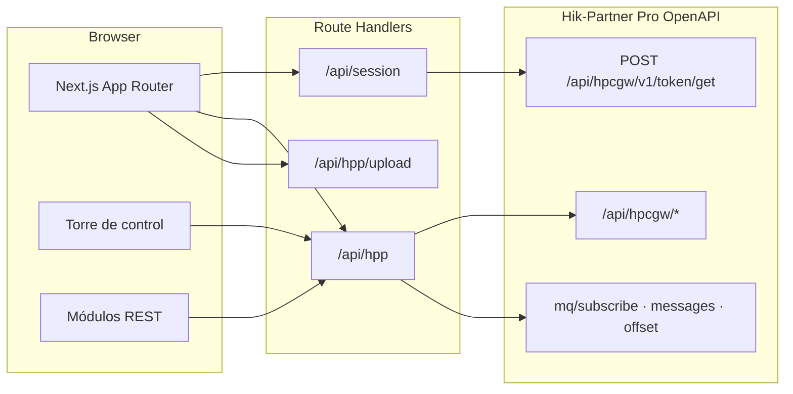

# HPP OpenAPI Lab (Hik-Partner Pro)

Laboratorio visual del OpenAPI **Hik-Partner Pro V2.15.500**. Next.js en Vercel o local; la sesión vive solo en cookies `httpOnly`. El servidor no guarda API Keys ni eventos.

> Documentación de plataforma (SYSCOM Labs): [HIKVISION/HikPartnerPro](https://github.com/SYSCOM-Labs/API-DOCS/tree/main/HIKVISION/HikPartnerPro)  
> PDF oficial: [OpenAPI Developer Guide V2.15.500](../../docs/Hik-Partner%20Pro%20OpenAPI%20Developer%20Guide_V2.15.500_20260904.pdf)

## Qué es este demo

No es un emulador. Cada acción llama a la cuenta real de Hik-Partner Pro. Sirve para dos cosas a la vez:

1. **Probar todos los endpoints REST** cubiertos por la guía 2.15.500 (formularios por módulo).
2. **Ver un ejemplo práctico de integración**: la **Torre de control** (`/demo`), un NOC ligero por instalación.

Live view, playback y two-way audio **no** están en este OpenAPI REST: requieren HPNetSDK (página VSaaS).

## Requisitos

- Node.js 18+ (recomendado 20 LTS)
- Cuenta Hik-Partner Pro con **AppKey** y **SecretKey**  
  (`Site & Device → My Service → API Integration`)
- Equipos reales o de laboratorio ya dados de alta (sitio + serial)

## Instalación

```bash
git clone https://github.com/SYSCOM-Labs/API-DOCS.git
cd API-DOCS/HIKVISION/HikPartnerPro/demos/OpenAPI-Lab
npm install
npm run dev
```

Abre [http://localhost:3000](http://localhost:3000).

| Comando | Descripción |
|---------|-------------|
| `npm run dev` | Desarrollo en `:3000` |
| `npm run build` | Build de producción |
| `npm start` | Sirve el build |

No hace falta `.env` de HPP. Las claves se pegan en **Conexión** y viajan en cookie.

## Arquitectura



El navegador no llama a Hik-Partner Pro (CORS + secreto). El proxy firma con `Token` y reenvía a `areaDomain`.

## Flujo recomendado

1. **Conexión** — pega AppKey / SecretKey → `token/get` → cookie 7 días.
2. **Torre de control** — inventario, salud, ranking de sitios, MQ y evidencia.
3. Si necesitas una operación concreta, abre el módulo (Sitios, Dispositivos, Audio…).
4. **Cobertura** y **Ayuda** confirman qué está dentro o fuera de REST 2.15.500.

Dashboard, Torre y Alarmas **comparten la cola MQ** de la AppKey. No dejes dos monitores activos a la vez.

---

## Demo principal: Torre de control (`/demo`)

Ejemplo de lo que un integrador montaría encima de las mismas APIs: no es un formulario de endpoint, es un panel operativo.

### Qué hace

| Capacidad | Origen de datos |
|-----------|-----------------|
| Selector **Todas las instalaciones** o un sitio | `site/search` + `device/list` |
| Disponibilidad, desconectados, `healthStatus=fault`, sitios con riesgo | Inventario |
| Ranking de prioridad (offline × 10 + fallas × 20 + eventos críticos × 3) | Inventario + MQ de la sesión |
| Timeline en vivo (todos / críticos / advertencias / recuperación / informativos) | `mq/subscribe` → `mq/messages` → `mq/offset` |
| Inventario filtrable del alcance | `device/list` |
| Detalle de incidente + payload | Evento MQ |
| Evidencia `ISAPI_FILES` | `alarm/pictureurl` |
| Exportar JSON / CSV (cliente) | Snapshot en memoria |

La suscripción MQ usa `subMode: all` o `subMode: list` con los seriales del sitio. Al detener o desmontar, hace `subType: 0` (unsubscribe). Los eventos viven solo en esa pestaña.

### Cómo probarla

1. Conecta la AppKey.
2. Abre **Torre de control**. El inventario se carga solo.
3. Elige **Todas las instalaciones** o un sitio concreto.
4. Revisa métricas y el ranking (sitios con más riesgo arriba).
5. Pulsa **Iniciar monitoreo**. Provoca un evento real (online/offline, movimiento, IO…).
6. Abre un evento: serial, tipo, hora, modelo, payload y, si hay `ISAPI_FILES`, **Obtener imagen**.
7. Exporta JSON (resumen + dispositivos + eventos) o CSV combinado.
8. Pulsa **Detener** y recarga: el timeline debe vaciarse.

### Límites que hay que explicar al cliente

- Requiere la pestaña abierta (long-poll ~20 s, `maxDuration` 60 s en Vercel).
- No sustituye un backend 24/7 ni un inbox de webhook.
- Imágenes cifradas: la URL existe, el preview no (hace falta descifrado según la guía HPP).
- `healthStatus` solo aparece si HPP lo entrega para ese modelo.

---

## Cómo se prueba cada capacidad desde el demo

### 1. Conexión (`/`)

| Qué probar | Cómo | API |
|------------|------|-----|
| Token y región | Pegar AppKey/SecretKey → **Conectar** | `POST /api/hpcgw/v1/token/get` |
| Sesión viva | Recargar: el pill del sidebar debe decir **Sesión activa** | cookie `httpOnly` |
| Cerrar sesión | **Cerrar sesión** y recargar un módulo | borra cookie |

Fallo típico: `LAP300001` / `LAP300002` (clave incorrecta). El token inicial se pide a `https://api.hik-partner.com`; el `areaDomain` de la respuesta es la base de las llamadas siguientes.

### 2. Dashboard (`/dashboard`)

Vista operativa de **toda** la cuenta (sin filtro de sitio).

1. **Actualizar estado** → hasta 100 dispositivos.
2. **Iniciar monitoreo** → MQ `subMode: all`.
3. Filtra por severidad y por serial.
4. Comprueba que un evento de Torre **no** debe duplicarse si Dashboard también está suscrito (una sola cola).

### 3. Sitios (`/sitios`)

| Operación | Cómo probarla | Cuidado |
|-----------|---------------|---------|
| Buscar | **Buscar sitios** | — |
| Crear | Nombre + `timeZone` (A.3, p. ej. `222`) | Sitio real |
| Editar / eliminar | Path `{id}` | Eliminar borra también dispositivos |
| Compartir / cancelar | Email empleado + siteId | Cuenta real |
| Managers | `v2/site/assign`, `sitemanagers` | Sustituye managers previos |
| Handover | `handover/share`, `customer/*` | Entrega a cliente Hik-Connect |
| Team sites | `site/team/*` | Alta / búsqueda / handover / borrar |

Usa un sitio de laboratorio. Cada tarjeta muestra método, path y JSON de respuesta.

### 4. Dispositivos (`/dispositivos`)

El tablero lista inventario al entrar.

| Operación | Cómo |
|-----------|------|
| Listar | Automático o **Probar API** `device/list` |
| Añadir | Serial + siteId (`v2/device/add`) |
| Actualizar / borrar | Serial |
| Cámaras | `device/camera/list` |
| Nube / PIN | `cloud/enable`, `pincode/query` |
| Firmware | `upgrade/state` → `upgrade` → `upgrade/progress` |
| Wake-up | `camera/wakeUp` (batería / solar) |

`deviceOnlineStatus`: `1` online, `0` offline. Upgrade y delete piden confirmación.

### 5. Alarmas (`/alarmas`)

Herramientas avanzadas sobre la misma cola MQ.

1. Alcance **Todos** o **Lista** (marca seriales del inventario).
2. **Iniciar muro**.
3. **Armar / stay / desarmar** (`defence/set` y `defence/get`) en paneles compatibles.
4. Pega `filePath` de `ISAPI_FILES` → **pictureurl**.

### 6. Webhook (`/webhook`)

| Operación | Cómo |
|-----------|------|
| Consultar | `config/query` |
| Guardar | URL HTTPS + tipos |
| Borrar | `config/delete` |

Este lab **no** guarda el POST entrante. Al activar webhook, el poll MQ puede dejar de recibir. El callback debe responder 2xx en &lt; 5 s y validar firma.

### 7. ARC (`/arc`)

Credenciales **ARC ID / Key**, no la AppKey de instalador.

- Listar habilitados, enable/disable, tipos de evento, número de cuenta, info de sitio.

Si la AppKey no es ARC, las llamadas fallan por permiso.

### 8. ISAPI / OTAP (`/transparente`)

Consola de reenvío. Elige dispositivo, carga plantilla, revisa URI/método/body y transmite.

Plantillas ISAPI: `deviceInfo`, hora, eventos/usuarios ACS, PTZ, presets, armar/desarmar, bypass, zonas, subsistemas, IO, canales proxy.

Plantillas OTAP: prop/direct/action/profile, batch get/set, table list.

Un PUT/DELETE incorrecto cambia firmware real.

### 9. Audio (`/audio`) — IP Speaker categoría 12 / subtipo 19

No hay streaming de audio por REST. El sonido sale del **altavoz**.

| Paso | Qué ocurre |
|------|------------|
| Vista previa | Solo en el navegador |
| Subir | Archivo MP3/WAV/AAC ≤ 10 MB, nombre **sin caracteres especiales** (`VMS050028`) |
| Aplicar | `audio/file/add` → `customAudioID` **por equipo** |
| Biblioteca | Se carga al elegir altavoz (`file/list/get`) |
| Volumen / prioridad | Van **dentro** de `audio/inter/cut` (`audioVolume` 0–100, `audioLevel` 0–15). No cambian un corte ya en curso |
| Reproducir | `audio/inter/cut` con `customAudioID` |
| Detener | `enabled: false` |
| TTS | `audioSource` texto, idioma/voz/pace; sí puede ir a varios altavoces |
| Playlist | Varios ítems en `playAudioList`; `playMode` `order` o `loop` |

Errores vistos en laboratorio: `VMS050020` (cut-in fallido en VMS), `VMS050028` (nombre con caracteres especiales). Diagnóstico de las últimas llamadas está al pie de la página.

### 10. VAS / salud (`/vas`)

`vas/opspack/active` — puede consumir licencia real.

### 11. Hot spare (`/hotspare`)

Alta host/spare, heartbeat (solo con la pestaña abierta), backup get/download/delete, baja.

### 12. Instaladores (`/instaladores`)

`installers/search` por nombre, email o teléfono. El `installerId` se usa en `site/assign`.

### 13. VSaaS (`/vsaas`)

Página de alcance: live/playback/two-way = HPNetSDK, no `/api/hpcgw`.

### 14. Cobertura y Ayuda

Inventario guía vs lab, y el flujo de operación. Usa **Cobertura** para no buscar un endpoint que 2.15.500 ya eliminó (`site/health/report`, `video/by/time`, cloud attendance, IoT query).

---

## APIs cubiertas por el laboratorio

Prefijo: `{areaDomain}/api/hpcgw/…`

| Módulo | Rutas |
|--------|-------|
| Token | `v1/token/get` |
| Sitios | `v1/site/search`, `add`, `{id}/update`, `{id}/delete`, `share`, `share/cancel/{id}`, `sitemanagers`, `customer/*`, `v2/site/assign`, `v2/site/handover/share`, `v1/site/team/*` |
| Dispositivos | `v1/device/list`, `update`, `delete`, `camera/list`, `cloud/enable`, `pincode/query`, `upgrade`, `upgrade/state`, `upgrade/progress`, `camera/wakeUp`, `v2/device/add` |
| Alarmas / MQ | `v1/mq/subscribe`, `mq/messages`, `mq/offset`, `alarm/pictureurl`, `device/v1/defence/set`, `defence/get` |
| Webhook | `webhook/v1/config/query`, `save`, `delete` |
| ARC | `v1/arcservice/device/list`, `enable`, `disable`, `event/type/update`, `account/number/update`, `site/{id}/info` |
| Audio | `v1/audio/file/add`, `file/list/get`, `file/del`, `audio/inter/cut` |
| VAS | `v1/vas/opspack/active` |
| Hot spare | `v1/hotspare/add`, `get`, `heartbeat`, `file/get`, `file/downloadurl`, `file/delete`, `delete` |
| Instaladores | `v1/installers/search` |
| Transparente | reenvío ISAPI / OTAP según plantilla |

Fuera de REST: live, playback, descarga, two-way; inbox persistente de webhook; APIs retiradas en 2.15.500.

## Tipos de evento MQ reconocidos

El lab etiqueta (entre otros): `cidEvent`, `VMD`, `IO`, `shelteralarm`, `fielddetection`, `linedetection`, `diskfull`, `diskerror`, `diskrecover`, `deviceonline`, `deviceoffline`, `devicedeleted`, `deviceadded`, `Linkage`, `videoloss`, `regionEntrance`, `regionExiting`, `recordException`, `ACSEvent`, `YsCallingEvent`, `manualRep`, `voiceTalkEvent`.

Severidad derivada: críticos (offline, disco, pérdida de vídeo), advertencias (VMD, IO, cruce, ACS…), recuperación (`deviceonline`, `diskrecover`), resto informativo.

## Despliegue en Vercel

Conecta el repo. Sin variables de HPP. `maxDuration` 60 s en `/api/hpp` para el long-poll.

Las cookies no viajan entre dispositivos: hay que conectar en cada navegador.

## Solución de problemas

| Síntoma | Qué hacer |
|---------|-----------|
| Sin sesión | Conexión → AppKey/SecretKey |
| MQ vacío | Un solo consumidor; no actives webhook y poll a la vez |
| Cut-in `VMS050020` | Altavoz en línea, categoría 12/19, ID de ese equipo, volumen/prioridad en rango |
| Upload `VMS050028` | Nombre de archivo alfanumérico, sin espacios ni símbolos |
| Foto de alarma en negro | Cifrado en dispositivo (`encrypt`) |
| Timeout en Vercel | Poll ≤ 60 s; no uses serverless para un 24/7 |

## Aviso

Proyecto de demostración para integradores SYSCOM. Hikvision y Hik-Partner Pro son marcas de sus titulares. No subas AppKey, SecretKey ni seriales de producción al repositorio.
